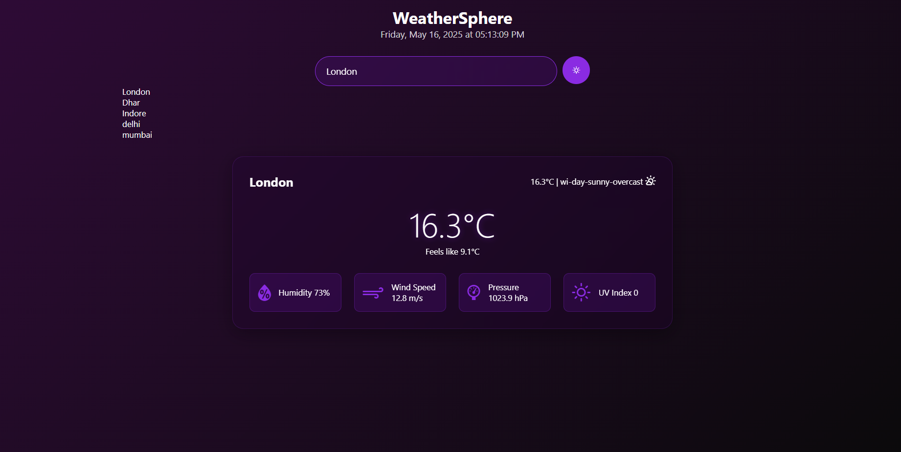

# 🌦️ WeatherSphere

**WeatherSphere** is a sleek and modern weather dashboard web application built with **Python**, **HTML**, **CSS**, and **JavaScript**. It allows users to search for any city and view real-time weather data and a short-term forecast with a beautiful glassmorphic UI.

---

## 🔥 Features

- 🔍 Search weather by city name  
- 📍 Current temperature, humidity, wind speed, and weather condition  
- 📅 5-day weather forecast  
- 🎨 Stylish UI with blur effects and gradient backgrounds  
- 💬 Toast notification for errors or invalid inputs  
- 📱 Responsive design for mobile and tablet screens  
- 🌐 Integration with OpenWeatherMap API (or similar)

---

## 💻 Tech Stack

| Frontend         | Backend     | API            |
|------------------|-------------|----------------|
| HTML5, CSS3, JS  | Python (Flask/FastAPI) | OpenWeatherMap API |

---

## 📸 Screenshots


---

## 🚀 Getting Started

### 1. Clone the Repository

```bash
git clone https://github.com/yourusername/weathersphere.git
cd weathersphere


